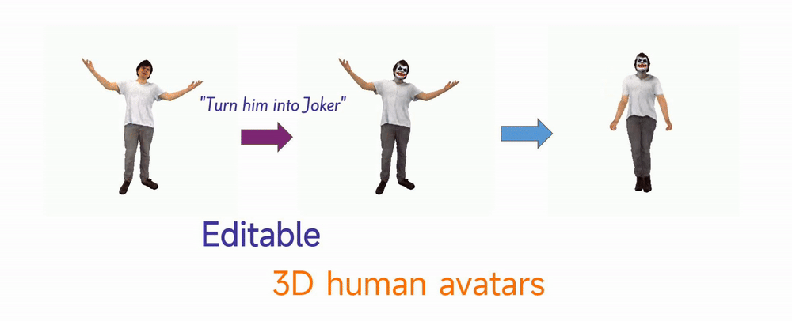

I am a CS Ph.D. candidate at [CVML group](https://cvml.comp.nus.edu.sg/) of the [National University of Singapore](http://www.nus.edu.sg/) (NUS), under the supervision of [Prof. Angela Yao](https://www.comp.nus.edu.sg/~ayao/). My current research interest focuses on editing of 3D human avatars.

I also received the degree of Master of Computing from NUS. Previously, I studied [Information Management and Information System](https://sme.bit.edu.cn/English/programs/enbk/majors/b131767.htm) at the [Beijing Institute of Technology](https://english.bit.edu.cn/).

# News

- [04/2024] The [[Code]](https://github.com/viridityzhu/InstructHumans), [[ArXiv]](https://arxiv.org/abs/2404.04037) and [[Website]](https://jyzhu.top/instruct-humans/) for the paper **InstructHumans: Editing Animatable 3D Human Textures with Instructions** is just released. Have a look at the results! [[👀]](https://jyzhu.top/instruct-humans/)
- [07/2023] One paper about high-fidelity hand reconstruction [[Code]](https://github.com/viridityzhu/HiFiHR) [[PDF]](https://arxiv.org/abs/2308.13628) is accepted to GCPR 2023. We will travel to Heidelberg, Germany in September!

# Publications

  
  

    
<strong>
      InstructHumans: Editing Animatable 3D Human Textures with Instructions
    </strong>

    

      <strong>Jiayin Zhu</strong>, <a href="https://www.mu4yang.com/">Linlin Yang</a>, <a href="https://www.comp.nus.edu.sg/~ayao/">Angela Yao</a>
    

    

      <a href="https://arxiv.org/abs/2404.04037">ArXiv:2404.04037</a>, 2024.
    

    

      <a href="https://jyzhu.top/instruct-humans/">Website</a>
       / 
      <a href="https://jyzhu.top/instruct-humans/data/InstructHumans.pdf">Paper</a>
       /
       <a href="https://github.com/viridityzhu/InstructHumans">Code</a>
    

  

  
  

    
<strong>
      HiFiHR: Enhancing 3D Hand Reconstruction from a Single Image via High-Fidelity Texture
    </strong>

    

      <strong>Jiayin Zhu</strong>, <a href="https://alicezrzhao.github.io/">Zhuoran Zhao</a>, <a href="https://www.mu4yang.com/">Linlin Yang</a>, <a href="https://www.comp.nus.edu.sg/~ayao/">Angela Yao</a>
    

    

      German Conference on Pattern Recognition (GCPR), 2023.
    

    

      <a href="https://arxiv.org/abs/2308.13628">Paper</a>
       / 
       <a href="https://github.com/viridityzhu/HiFiHR">Code</a>
    

  

  
  

    
<strong>
      3D Magic Mirror: Clothing Reconstruction from a Single Image via a Causal Perspective
    </strong>

    

      <a href="https://www.zdzheng.xyz/">Zhedong Zheng</a>, <strong>Jiayin Zhu</strong>, Wei Ji, Yi Yang, Tat-Seng Chua
    

    

      <a href="https://arxiv.org/abs/2204.13096">ArXiv:2204.13096</a>, 2022.
    

    

      <a href="https://zdzheng.xyz/files/3D_Recon.pdf">Paper</a>
       /
       <a href="https://github.com/layumi/3D-Magic-Mirror">Code</a>
    

  

# Services

- Teaching Asistant
  - [CS2100 Computer Organisation](https://nusmods.com/courses/CS2100/computer-organisation) in Sem 1 AY2023/2024
  - [CS4243 Computer Vision and Pattern Recognition](https://nusmods.com/courses/CS4243/computer-vision-and-pattern-recognition) in Sem 2 AY2023/2024
- Reviewer: NeurIPS, ECCV, AAAI

---

# Others

- [My Blog](https://jyzhu.top/blog) (I post and archive study notes here, and occasionally write other weird stuff.)

- Hopefully, I would keep reading ([reading list](https://jyzhu.top/blog/books/)).
